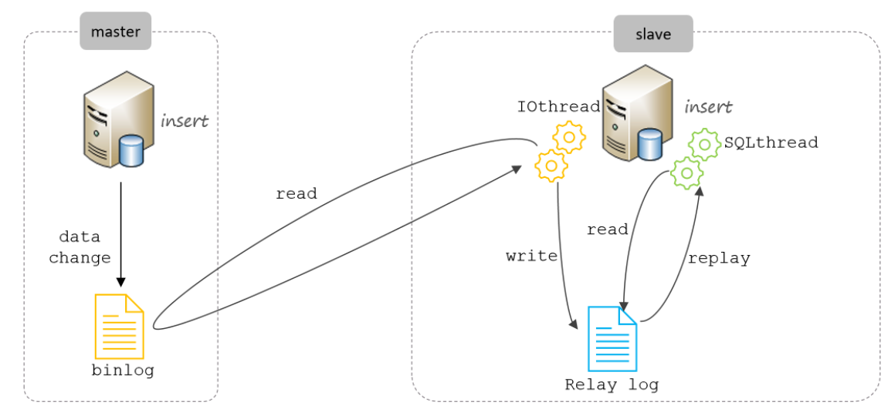
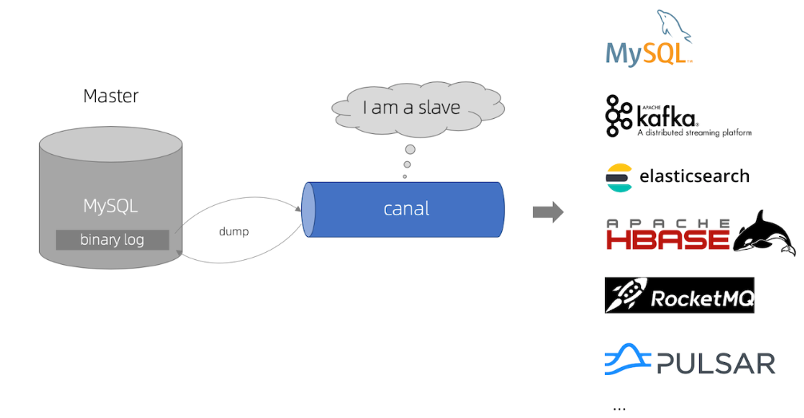
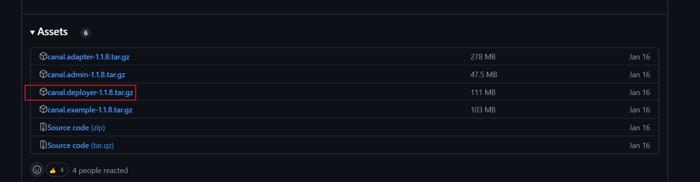

### Canal

[alibaba/canal: 阿里巴巴 MySQL binlog 增量订阅&消费组件](https://github.com/alibaba/canal)

Canal 组件是一个基于 MySQL 数据库增量日志解析，提供增量数据订阅和消费，支持将增量数据投递到下游消费者（如 Kafka、RocketMQ 等）或者存储（如 Elasticsearch、HBase 等）的组件。

总的来说，就是一个伪装更从库获取主库数据变动，将数据变动发送给下游的数据同步组件。


#### MySQL主从复制原理

1. 主库开启binlog 日志
2. 主库的增删改操作，都会记录到binlog日志中。
3. 从库感知主库binlog的binlog日志的变化，每当发生改变，启用一个IO线程去读取主库binlog文件，并记录下来存在 Relay log（中继文件）中。
4. 最后利用Relay log 重放主库的bin log，完成数据同步。



tips: 

 	1. `bin log` 日志怎么开启?  
 	2. 从库怎么感知主库的binlog 变化？
 	3. `bin log` 日志到底是什么，怎么能重放就能完成数据同步？


#### Bin log 日志 

MySQL 的Binlog，它记录了所有的 DDL 和 DML语句，也就是记录了数据库中数据的变化。

`bin log `的应用

+ 数据复制（主从同步）。
+ 数据恢复（误操作恢复、灾难恢复）。
+ 变更数据捕获（实时数据同步、数据异构）。
+ 审计和日志分析


1. **如何开启binlog 日志**

`MySQL 5. 7`默认情况下是不开启Binlog，因为记录Binlog日志需要消耗时间，官方给出的数据是有1%的性能损耗。最主要的是，早期阶段，那个时期往往是单机mysql。往往不需要进行数据复制，而且开启bin log 还要一些格外的配置

比如，设置 `server_id`：主从复制时，每个 MySQL 实例需要唯一的 `server_id`；选择 `binlog_format`：需要根据业务需求选择合适的 binlog 格式（STATEMENT、ROW 或 MIXED）。对于不熟悉 MySQL 的用户来说，这些配置可能会增加使用难度。

总的来说 `Mysql 5.7 `默认不开启`binlog `是因为以下三个方面

1. 往往是单机mysql。往往不需要进行数据复制。
2. 而且开启bin log 还要一些格外的配置，对不熟悉Mysql 的用户来说，会导致使用难度的增加。
3. 性能消耗（在现在来看微乎其微）


**MySQL 8.0 及以上版本**：binlog 默认是**开启**的。

可以通过sql 查看是否开启

```sql
SHOW VARIABLES LIKE 'log_bin';  
```

+ 如果返回结果为 `ON`，则表示 binlog 已开启。
+ 如果返回结果为 `OFF`，则表示 binlog 未开启。


如果 binlog 未开启，你可以通过以下步骤启用它：

**修改 MySQL 配置文件**

+ 找到 MySQL 的配置文件（通常是 `my.cnf` 或 `my.ini`）。

+ 在 `[mysqld]` 部分添加或修改以下配置：

  ```
  [mysqld]
  log_bin = /var/lib/mysql/mysql-bin.log  # binlog 文件路径
  server-id = 1                           # 服务器唯一 ID（主从复制时需要）
  binlog_format = ROW                    # 推荐使用 ROW 模式
  expire_logs_days = 7                   # 设置 binlog 过期时间（单位：天）
  ```

+ 配置说明：

  + `log_bin`：指定 binlog 文件的路径和名称。
  + `server_id`：每个 MySQL 实例需要唯一的 ID（主从复制时必需）。
  + `binlog_format`：binlog 的格式，推荐使用 `ROW` 模式（支持更精确的变更数据捕获）。
  + `expire_logs_days`：设置 binlog 文件的保留时间，避免磁盘空间被占满。

+ 重启服务， 再次验证是否开启  ```SHOW VARIABLES LIKE 'log_bin';```


 **binlog 的格式**

binlog 有三种格式，可以通过 `binlog_format` 参数设置：

1. **STATEMENT**：
   + 记录 SQL 语句。
   + 优点：日志文件较小。
   + 缺点：某些操作（如非确定性函数）可能导致主从不一致。
2. **ROW**（推荐）：
   + 记录每一行数据的变更。
   + 优点：精确记录数据变更，适用于数据同步和恢复。
   + 缺点：日志文件较大。
3. **MIXED**：
   + 结合 STATEMENT 和 ROW 模式。
   + 默认使用 STATEMENT，在某些情况下自动切换到 ROW。

可以通过以下命令查看当前 binlog 格式：

```sql
SHOW VARIABLES LIKE 'binlog_format';
```

**综合上面对比，Canal 想做监控分析，选择 row 格式比较合适。** 


2. **从库怎么感知binlog 日志**


#### canal 工作原理



+ canal 模拟 MySQL slave 的交互协议，伪装自己为 MySQL slave ，向 MySQL master 发送dump 协议
+ MySQL master 收到 dump 请求，开始推送 binary log 给 slave (即 canal )
+ Canal 接收并解析 Binlog 日志，得到变更的数据，执行后续逻辑


#### Canal实战

1.准备环境

1. 创建一个 Canal-demo表


2.  开启bin log 日志  my.ini

```ini
[mysqld]
log-bin="LAPTOP-O4ONRGLK-bin"  # binlog 文件路径
server-id = 1                           # 服务器唯一 ID（主从复制时需要）
binlog_format = ROW                    # 推荐使用 ROW 模式
expire_logs_days = 7                   # 设置 binlog 过期时间（单位：天）
```

重启mysql 服务 并 查看是否开启 ```show variables like 'log_bin'```


tips： mysql 启动错误，排查，可以根据错误日志，交给gpt。


3. 安装Canal

[Releases · alibaba/canal](https://github.com/alibaba/canal/releases/tag/canal-1.1.8)



**修改canal.properties的配置**

```yaml
canal.port = 11111
# tcp, kafka, rocketMQ, rabbitMQ, pulsarMQ
canal.serverMode = tcp
 
canal.destinations = example
```


canal.port：默认端口 11111

canal.serverMode：服务模式，tcp 表示输入客户端，kafka, rocketMQ, rabbitMQ, pulsarMQ 表示输入MQ.

canal.destinations：canal能可以收集多个MySQL数据库数据，每个MySQL数据库都有独立的配置文件控制。具体配置规则： conf/目录下，使用文件夹放置，文件夹名代表一个MySQL实例。canal.destinations用于配置需要监控数据的数据库。如果是多个，使用,隔开。建议直接复制example，然后重命名配置不同的Mysql实例。

 **修改Canel 下MySQL实例配置文件instance.properties**

```yaml
canal.instance.mysql.slaveId=20
 
# position info
canal.instance.master.address=127.0.0.1:3306
 
# username/password
canal.instance.dbUsername=root
canal.instance.dbPassword=admin
```

* canal.instance.mysql.slaveId：伪装成 mysql从库，数据库服务的id。


启动 bin/startup.bat

 启动脚本错误

```text
start cmd :  java   -Xms128m -Xmx512m -XX:PermSize=128m  -Djava.awt.headless=true -Djava.net.preferIPv4Stack=true -Dapplication.codeset=UTF-8 -Dfile.encoding=UTF-8  -server -Xdebug -Xnoagent -Djava.compiler=NONE -Xrunjdwp:transport=dt_socket,address=9099,server=y,suspend=n  -DappName=otter-canal -Dlogback.configurationFile="D:\development_tool\canal-1.1.8\bin\\..\conf\logback.xml" -Dcanal.conf="D:\development_tool\canal-1.1.8\bin\\..\conf\canal.properties" -classpath "D:\development_tool\canal-1.1.8\bin\\..\conf\..\lib\*;D:\development_tool\canal-1.1.8\bin\\..\conf" java   -Xms128m -Xmx512m -XX:PermSize=128m  -Djava.awt.headless=true -Djava.net.preferIPv4Stack=true -Dapplication.codeset=UTF-8 -Dfile.encoding=UTF-8  -server -Xdebug -Xnoagent -Djava.compiler=NONE -Xrunjdwp:transport=dt_socket,address=9099,server=y,suspend=n  -DappName=otter-canal -Dlogback.configurationFile="D:\development_tool\canal-1.1.8\bin\\..\conf\logback.xml" -Dcanal.conf="D:\development_tool\canal-1.1.8\bin\\..\conf\canal.properties" -classpath "D:\development_tool\canal-1.1.8\bin\\..\conf\..\lib\*;D:\development_tool\canal-1.1.8\bin\\..\conf" com.alibaba.otter.canal.deployer.CanalLauncher
Unrecognized VM option 'PermSize=128m'
Error: Could not create the Java Virtual Machine.
Error: A fatal exception has occurred. Program will exit.
请按任意键继续. . .

```

原因是 启动脚本还是使用的jdk 8 的参数。但是我的是jdk 17,

把参数移除，不写，或者使用原空间替代。


编写java代码

创建maven项目

引入依赖

```xml
  <dependency>
            <groupId>com.alibaba.otter</groupId>
            <artifactId>canal.client</artifactId>
            <version>1.1.0</version>
        </dependency>
```


编写测试类

```java
package com.ls;


import com.alibaba.otter.canal.client.CanalConnector;
import com.alibaba.otter.canal.client.CanalConnectors;
import com.alibaba.otter.canal.protocol.CanalEntry;
import com.alibaba.otter.canal.protocol.Message;
import com.google.protobuf.ByteString;
import com.google.protobuf.InvalidProtocolBufferException;

import java.net.InetSocketAddress;
import java.util.HashMap;
import java.util.List;
import java.util.Map;


public class HelloCanal {
    public static void main(String[] args) throws InvalidProtocolBufferException {
        //1.获取 canal 连接对象
        CanalConnector canalConnector = CanalConnectors.newSingleConnector(new InetSocketAddress("localhost", 11111), "canal-demo", "", "");
        while (true) {
            //2.获取连接
            canalConnector.connect();
            //3.指定要监控的数据库
            canalConnector.subscribe("canal-demo.*");
            //4.获取 Message
            Message message = canalConnector.get(100);
            List<CanalEntry.Entry> entries = message.getEntries();
            if (entries.size() <= 0) {
                System.out.println("没有数据，休息一会");
                try {
                    Thread.sleep(1000);
                } catch (InterruptedException e) {
                    e.printStackTrace();
                }
            } else {
                for (CanalEntry.Entry entry : entries) {
                    // 获取表名
                    String tableName = entry.getHeader().getTableName();
                    //  Entry 类型
                    CanalEntry.EntryType entryType = entry.getEntryType();
                    //  判断 entryType 是否为 ROWDATA
                    if (CanalEntry.EntryType.ROWDATA.equals(entryType)) {
                        //  序列化数据
                        ByteString storeValue = entry.getStoreValue();
                        //  反序列化
                        CanalEntry.RowChange rowChange = CanalEntry.RowChange.parseFrom(storeValue);
                        // 获取事件类型
                        CanalEntry.EventType eventType = rowChange.getEventType();
                        // 获取具体的数据
                        List<CanalEntry.RowData> rowDatasList = rowChange.getRowDatasList();
                        // 遍历并打印数据
                        for (CanalEntry.RowData rowData : rowDatasList) {
                            List<CanalEntry.Column> beforeColumnsList = rowData.getBeforeColumnsList();
                            Map<String, Object> bMap = new HashMap<>();
                            for (CanalEntry.Column column : beforeColumnsList) {
                                bMap.put(column.getName(), column.getValue());
                            }
                            Map<String, Object> afMap = new HashMap<>();
                            List<CanalEntry.Column> afterColumnsList = rowData.getAfterColumnsList();
                            for (CanalEntry.Column column : afterColumnsList) {
                                afMap.put(column.getName(), column.getValue());
                            }
                            System.out.println("表名:" + tableName + ",操作类型:" + eventType);
                            System.out.println("改前:" + bMap );
                            System.out.println("改后:" + afMap );
                        }
                    }
                }
            }
        }
    }

}

```


* 核心就是这个，获取canal连接对象，ip,port , 伪造的从节点， 账号，密码

```java
   CanalConnector canalConnector = CanalConnectors.newSingleConnector(new InetSocketAddress("localhost", 11111), "canal-demo", "", "");

```

* 指定要监控的数据库（主库）

```java
    //3.指定要监控的数据库
            canalConnector.subscribe("canal-demo.*");
```


  当我们修改数据库

  

监测成功。